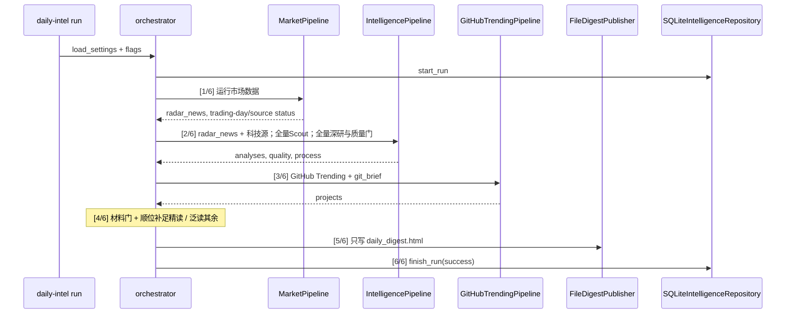

# 科技产业情报日报：现况设计文档

| 字段 | 值 |
| --- | --- |
| 文档标题 | 科技产业情报日报现况设计（As-Built） |
| 作者 | 项目维护者（据 `src/daily_intel` 现码整理） |
| 日期 | 2026-08-29 |
| 状态 | Accepted（精简后） |
| 代码版本 | `daily_intel` 0.4.0（`src/daily_intel/__init__.py`） |
| 质量策略 | `evidence-gate-v2` |
| 提示词版本 | `tech-intel-v3` |
| 性质 | **现况（as-built）文档**，描述仓库里已经在跑的应用，不是绿场提案 |

> **2026-08-29 精简已落地。** 产品只出 HTML 日报。已删除 Harness 文件桥、双模型对照脚本、GitHub 以外的 HF/GitLab/使用场景、`language_bars`、非 HTML 产物（md/json/csv/`process.html`）、公司映射与巨潮核验、个股 `scoring.py`、`scan_paragraph`、第二份定时任务、以及市场筛选死字段。下文若仍写这些能力，以源码为准。SQLite 仍保留 `company_mappings` 表，仅为读旧库，产品页不再展示。

包内 `__init__.py` / `__main__.py` 只做导出或 `cli.main` 转发，下文不单独开节。HTTP `User-Agent` 现码不一致：`feeds.py` / `common.py` / 新浪指数抓取仍是 `DailyIntel/0.3`，GitHub Trending 是 `DailyIntel/0.4`；见 Open Question 7。

---

## Overview

本仓库是一份可每日运行的**模块化单体应用**，不是 Skill、不是对话代理、也不是选股系统。一次安装、一个 CLI（`daily-intel`）、一份 HTML 日报：科技白名单与 AkShare 市场快讯统一经过 72 小时**库内**聚类、35/65 融合 Scout、全文增强、逐事件深研、独立校验和确定性质量门，再与 GitHub 热门项目一起发布到 `output/YYYY-MM-DD/runs/<run-name>/daily_digest.html`。

总的设计思路可以压成一句话：**模型只生成候选结构，程序拥有去重、证据核验、质量裁决和发布规格。** 换模型不能改变“什么可以作为深度结论”。AkShare 是 Tier 3 雷达，不是独立选题或观察名单；它与其他内容使用同一个 Scout。产品标题已是「科技产业情报日报」，日报不展示个股扫描。

对外「今日速读」是精读结果的 kicker + 一句话，由 `build_plain_digest` 从 analyses 生成。生产由 DeepSeek 分批泛读全部候选、保留全局前 40 后统一复排；最终前十才运行 Analyst + Verifier。未进前十及精读失败项只作为泛读摘要；`digest_brief` 不再参与日常发布。

---

## Background & Motivation

产品从「A 股观察日报」演进到「科技产业情报日报」。这条路径解释了当前架构里许多看似多余的边界。

**可读性。** 读者不是论文作者。未解释的术语是缺陷：`plain_takeaway` 必须 2–3 句大白话，专业名词首次出现立刻用人话解释；解释不得引入文档没有的数字、排名或公司属性。

**意见 vs 证据。** 合法后端是 OpenAI 兼容 API（局域网 DeepSeek / Qwen，或云端示例）。生产早间任务走局域网 API。不要在应用外重做采集、分析或发布。

**生产是 DeepSeek 单模型链路。** `config/settings.deepseek.yaml` 的后端是 DeepSeek V4 Flash（`192.168.31.236:8000`）。它扫描全部候选、截取全局前 40、再次复排，并负责最终前十的 Analyst、Verifier 与确定性质量门。选题使用独立的 `broad-reading-v1`、模型/端点指纹和 `rank-fusion-v5-deepseek` 缓存键；分析缓存 scope 不变。独立 `settings.qwen.yaml` 只用于手工兼容性检查并写 `data/intelligence_qwen.db`，不参与生产链路。

**今日速读（对外）。** `plain_digest.tech_items`：精读条目的每条主题词（kicker）+ `_scan_line`（`plain_takeaway` 第一句）。不要把「深/线索」徽章埋在速读里。主题词只看标题和速读句：Transformers 发版即使 key_facts 提到蛋白质模型，也不能 kicker 成「生物」。精读卡和速读共享同一份按首次出现主题稳定分组的列表，同主题相邻，组内仍是 Scout 顺序。

**AkShare 市场雷达。** `MarketPipeline` 只负责合并、标准化快讯以及交易日/来源状态；`market.radar_news` 由编排器传入 `DocumentCollector.radar_documents`，以 Tier 3 `news_radar` 文档进入统一 Scout。旧的关键词 `rank_market_news` 和独立市场发布链已移除。

**重复发表惩罚。** 前一天已经发布过的科技事件，第二天入选权重乘 `0.4`（`selection_repeat_penalty`，窗口 36 小时，跨日且有新文档时略回升）。同库多实验时该查询**不**按 `cache_scope` 过滤，见 §5 与 PR 4。

**Git 页。** 只抓 GitHub 今日最热 + 本周增长最快。仓库身份只取 Trending 卡片标题链接，不能把前置 Sponsor 按钮当成仓库。AI 逐仓库对照 README、清单和源码入口生成中文功能说明与具体使用场景；API 匿名额度耗尽时 README 回退到 `raw.githubusercontent.com`。卡片展示当前总星标，日/周增量只在副标题出现，不绘制相对峰值进度条。不要 Hugging Face / GitLab、不要语言热度看板、不要「此为推演」。

**精读与泛读。** `preferred_general_events` / `preferred_hardcore_events` 仍用于最终复排后的覆盖排序，但不形成用户可见子栏目。只有固定前十允许研究；若其中某条失败或材料门不通过，不从第 11 条补做昂贵研究。泛读项带 `issues=["broad_reading_only"]`，不写分析缓存，也永远不能被材料门补位成精读。完整研究仍需至少 2 条有效证据和 160 字去重引文；Tier 2/3 缺少一手来源时不能升成深度结论。

**Windows。** `pypdf` 往 stderr 打警告不得中断运行；PowerShell `Tee-Object` 编码会弄坏中文；`cmd.exe` 的 UTF-8 中文解析不稳定，所以根启动器是 ASCII-safe `.cmd`。

**产物。** 每次运行只写 `daily_digest.html`。采集/选题决策仍记在 SQLite 运行元数据和 HTML「运行、模型与来源状态」折叠块里。

---

## Goals & Non-Goals

### Goals

- 每天产出一份可追溯的科技产业情报 HTML 日报。
- 模型可替换（局域网 OpenAI 兼容 API，或云端示例），发布底线不变。
- 来源、分析阶段、市场逻辑、展示方式独立演进；失败局部降级，不补造事实。
- 同一天可多次运行、互不覆盖；不同实验/模型的分析缓存隔离（生产靠分库；同库旁表与 `get_latest_analyses` 仍有缺口）。
- 无密钥也能采集并发布明确标为「线索」的事件。

### Non-Goals

- 不是投资建议，不是个股扫描，不是交易信号系统。
- 不是 Skill / 对话代理 / Harness 文件桥。
- 不在应用内调用 Qlib / RD-Agent（二者只作为 GitHub Release 信源）。
- 不在日期根目录写报告副本或 `latest_run.json`（历史目录里的旧副本保留不删）。
- 不让 AkShare 快讯绕过统一 Scout 和质量门直接发布。
- 测试不替代读日报，不调用真实模型和外网。
- 不把 `INDEX_BOARD` 的「A股」地理标签当成旧产品名清掉。

---

## 总的设计思路

### 1. 模块化单体，不是微服务，也不是 Skill

一次安装（`.venv`）、一个入口（`daily-intel` / `python -m daily_intel`）、一份消化结果。包边界按**变化原因**切开：

| 包 | 变化原因 |
| --- | --- |
| `core` | 契约变了才动 |
| `intelligence` | 信源、选题、深研、质量规则 |
| `market` | AkShare 快讯、交易日与缓存适配 |
| `github` | 开源热门榜 |
| `infrastructure` | SQLite、HTTP、某个模型厂商 |
| `publication` | 模板和推送 |
| `app` | 把上面几条流水线按固定顺序粘起来 |

`docs/architecture.md` 的依赖规则是**意图**；与现码不完全重合的地方必须写清：

1. `core` 不依赖业务实现。**现码成立。**
2. `intelligence` 与 `market` **包**互不 `import`，只在 `app/orchestrator.py` 汇合。**包级成立。** 但 `github/` 与 `publication/` 都 `import daily_intel.market.normalize.clean_text`（分层泄漏，规则未写）。`CompanyMapper` 在情报侧直接调 AkShare/巨潮。
3. AI 分析和公司映射不得写入市场候选分数。**现码成立。**
4. **端口意图**是 LLM / 存储 / 市场快照走 `LLMClient` / `IntelligenceRepository` / `MarketProvider`，业务阶段不依赖 SQLite 类、某个模型 SDK 类。**例外（现码）：** `intelligence/mapping.py` 的 `CompanyMapper` 直接 `import akshare as ak`，调用 `ak.stock_zh_a_disclosure_report_cninfo` 与 `ak.stock_industry_change_cninfo`，不是 `MarketProvider`。
5. `publication` 只消费标准化结果：不采集、不调模型、不重新裁决质量。**现码成立。**
6. 新阶段失败返回局部错误或降级状态，不能补造事实。**现码成立。**
7. 分析与 Scout 缓存必须包含实验标识和模型指纹；不同模型不得互相复用 **`analysis_variants` / Scout state 键**。**成立。** 但 `EventSelector._recent_analyses()` 与离线 `get_latest_analyses(limit * 4)` **省略 `cache_scope`**，同库多实验会共享次日 0.4 惩罚和离线复用。生产只使用 DeepSeek；手工 Qwen 检查另用文件库规避。

### 2. 程序拥有发布规格，模型只出草稿

五个模型阶段（`scout` / `analyst` / `verifier` / `git_brief` / `digest_brief`）都输出 Pydantic 结构。真正决定「能不能叫深度结论」的是 `AnalysisQualityGate.evaluate()`：`passed=False` 则 `build_analysis()` 只能得到 `AnalysisStatus.LEAD`。

任一 issue 都会让 `passed=False`。完整 taxonomy（与 `publication/reporting.py` `QUALITY_ISSUE_LABELS` 一致）：

| `issues` 键 | 触发 |
| --- | --- |
| `verifier_not_pass` | `VerificationResult.verdict != "pass"` |
| `unsupported_claims` | verifier 列出实质性不支持结论，且 `downgrade_on_unsupported_claims`（默认 true） |
| `insufficient_evidence` | 核验通过的原文引文 &lt; `min_supported_evidence`（2） |
| `missing_primary_source` | Tier 1 来源数 &lt; `min_primary_sources`（1） |
| `insufficient_key_facts` | 去重后事实 &lt; `min_key_facts`（3） |
| `missing_plain_takeaway` | `plain_takeaway` 空白 |
| `missing_required_sections` | `technical_mechanism` / `novelty` / `maturity` / `outlook_6_24m` 任一空白 |
| `insufficient_risks` | 风险 &lt; 2 |
| `insufficient_counterpoints` | 反面观点 &lt; 1 |
| `ai_not_enabled` | 无 AI 线索路径写入，不是 `evaluate()` 的产物 |

引文规则：去空白后必须是对应文档 `content+summary` 的连续子串；`evidence.url` 去尾斜杠后等于 `document.url`；`document_id` 必须在本事件文档集；重复 `(document_id, quote)` 丢弃。

置信度封顶：单一来源 ≤ 0.85；深度结论 ≤ 0.90；线索 / 未通过 ≤ 0.49。

未通过时 `build_analysis()` **丢掉** `technical_mechanism` / `novelty` / `maturity` / `outlook_6_24m` / `industry_impacts` / `company_mappings`，并把 `risks` 写成 `质量门降级：` + issue 键列表。只保留 headline、plain_takeaway、key_facts、evidence、quality。

「两条原文证据 + 一手来源 + 无 unsupported」是必要但**不充分**：还要 verifier pass、3 条事实、plain_takeaway、四段必填、2 风险、1 反面观点。

换模型、换 Harness、换提示词，都不能绕过这扇门直接构造 `AnalysisStatus.DEEP`。

### 3. AkShare 是统一情报链的 Tier 3 雷达

市场流水线不再拥有独立的选题或发布列表。它只合并同花顺/新浪快讯、标准化字段并记录交易日与来源状态。完整 `radar_news` 在编排器中交给 `IntelligencePipeline`，再由 `DocumentCollector.radar_documents` 转成 `source_tier=3`、`content_type=news_radar` 的文档。此后与科技白名单一样聚类、进入 Scout、深研和质量门；Tier 3 快讯不能单独支撑深度结论。

### 4. 证据身份与采集身份分离

`collector_id`（适配器 `id`）管游标和失败状态；`publisher_id` 写入 `Document.source_id`，管证据计数。同一篇 arXiv 论文可以被分类 API 和 Hugging Face Daily Papers 同时发现，但 `publisher_id: arxiv` 后只存一份、只计一个来源。Tier 描述的是证据身份，不等于文章一定正确。

### 5. 实验隔离是正确性，不是优化

`ModelStageRunner.cache_scope()` 把 `experiment_id`、provider、configured_models、`prompt_version`、`quality.policy_version` 哈希成 12 位指纹。`get_analysis` / `save_analysis` 走 `analysis_variants(event_id, cache_scope)`。Scout 排序缓存在 `pipeline_state`，键含 `prompt_version` 与 `cache_scope`。`--force-analysis` 只绕过当前作用域，不删历史输出、不删别的实验。误用同一个 `experiment_id` 给另一个模型，等于污染缓存——`AGENTS.md` 明确禁止。

**未隔离的路径（同库才暴露）：**

- `save_analysis` 按 `event_id` `DELETE` 再写 `evidence` / `industry_mappings` / `company_mappings`，旁表无 `cache_scope`。
- `EventSelector._recent_analyses` 调用 `get_latest_analyses(80)` 不传 scope → 次日惩罚可能吃到另一实验昨天的发布。
- 离线 `IntelligencePipeline._offline_result` 同样不传 scope。

生产只使用 DeepSeek 库；手工 Qwen 检查使用独立库，所以上述缺口日常不发作。同库 A/B 仍危险。

### 6. 降级优于停机

单个来源失败标 `stale` 并继续；Scout 失败回退确定性排序；无密钥发线索版。`--require-ai` 才把缺密钥/离线当成硬失败，给早间任务用。

单事件深研失败的重试是**两层**：

1. `OpenAICompatibleLLM.generate`：JSON 解析 / `ValidationError` 时对端点再请求一次（阶段内最多 2 次 HTTP）。
2. `ModelStageRunner._generate`：捕获异常后再调一次 `generate`（外层最多 2 次）。解析失败时一个阶段最多打 LAN **4** 次。`run_meta` 的 token 会计入这些内层重试。
3. `IntelligencePipeline` 对 `researcher.analyze` 还有 `try/except`：两层都失败则跳过该事件，不合成伪分析。

---

## Proposed Design（现况运行流）

```text
SourceAdapter[] ────────────────> DocumentCollector ──> EventCatalog ──> EventSelector
                                      ^                                  │
                                      │ AkShare radar_news               v
MarketWorkflow ───────────────────────┘       AnalysisQualityGate <── EventResearcher
                                                      │
GitHubTrending ────────────────> app/orchestrator <────┘
                                      │
                                      v
                              DigestPublisher
                         精读合格前十 / 泛读其余 / Git
```

对外「今日速读」由精读合格项生成；泛读短句由剩余 `Analysis` 生成，两者都不经过 `digest_brief`。

编排器实际顺序（`run_application()`，带 `[1/6]…[6/6]`）：



现场进度字符串：`[4/6] 汇总分析、质量门与页签数据…`；质量门实际已在 `[2/6]` 的 `EventResearcher` 内逐事件完成。该阶段只补 Git 说明并切分展示层，不再调用独立市场摘要模型。

一次运行由 `experiment_id`、唯一 `run_name`（默认 `{HHMMSS}-{run_id:04d}-{experiment_id}`）和模型指纹共同标识。产物只写 `output/YYYY-MM-DD/runs/<run-name>/`。若该目录已有日报文件，`publish()` 抛 `FileExistsError`，拒绝覆盖。

---

## 模块设计：app/

### `app/cli.py` — 人机边界，不是业务

**理念。** CLI 只翻译开关、加载 YAML、调用 `run_application()`、打印路径。业务判断全部在编排器和各流水线。

**需求。**

| 命令/开关 | 行为 |
| --- | --- |
| `daily-intel run` | 采集并生成日报 |
| `--config` | 默认 `config/settings.yaml`（生产脚本覆盖为 deepseek/qwen） |
| `--offline` | 只用市场 CSV 缓存和库里已有分析 |
| `--no-ai` | 采集科技来源但不调模型，发线索 |
| `--require-ai` | 缺密钥或与 offline/no-ai 冲突则失败（退出码 2） |
| `--experiment-id` | 隔离缓存、区分同日多份输出 |
| `--force-analysis` | 忽略当前实验/模型作用域内的分析缓存 |
| `--open` | 生成后用系统浏览器打开 HTML |
| `daily-intel doctor` | 检查依赖版本、来源数量、密钥环境变量名、路径；不访问网络 |

`--no-ai` 与 `--require-ai` 互斥。默认配置路径是仓库相对的 `config/settings.yaml`；早间任务不走这条默认路径。

**禁止。** 在 CLI 里做采集、调模型、写文件、解释质量门。

### `app/orchestrator.py` — 唯一汇合点

**理念。** AkShare、情报、Git 三条采集路径在这里汇合。编排器把 `market.radar_news` 明确传给情报流水线，并组装发布上下文，但不实现抓取、提示词或证据判断。

**需求。**

- 注入点：`llm`、`repository`、`market_workflow`、`intelligence_workflow`、`publisher`、`github_workflow`。测试和 Harness 都走这些口。
- 默认实现：`OpenAICompatibleLLM`、`SQLiteIntelligenceRepository`、`MarketPipeline`、`IntelligencePipeline`、`FileDigestPublisher`、`GitHubTrendingPipeline`。
- 先 `install_proxy_fallback()`，再跑市场。
- `require_ai and (offline or no_ai)` 立即 `RuntimeError`。
- 进度行：`[1/6] 运行市场数据` → `[2/6] 采集、去重并聚类` → `[3/6] 采集开源热门项目` → `[4/6] 汇总分析、质量门与页签数据` → `[5/6] 生成 HTML` → `[6/6] 保存运行状态`。细项用 `当前：…`。
- `[1/6]` 的 AkShare 标准化结果不直接发布；`radar_news` 在 `[2/6]` 进入统一 EventCatalog 和 Scout。
- `[4/6]` 按 `intensive_reading_events` 和精读材料门从成功分析中顺位补足精读，其余进入泛读，并可调用 `git_brief`；不再调用独立 `digest_brief`。
- AI 状态文案：`enabled` / `disabled` / `cached` / `unavailable` 映射到中文标签。
- `git_brief` 失败记入 `pipeline_errors`，Git 卡使用已有描述降级，不中断运行。
- `run_meta` 必须记录真实客户端元数据（`intelligence.model_runtime`），不能把静态 YAML 当运行结果。

**禁止。** 为 AkShare 恢复一条绕过 Scout 的发布链；在编排器里做质量裁决；把报告写到日期根目录。

---

## 模块设计：core/

`core` 是稳定契约层。改这里等于改产品宪法。

### `core/models.py` — 领域对象

**理念。** 全部 `StrictModel`（`extra="forbid"`）。草稿限额宽于发布限额：模型可以啰嗦，质量门裁剪后再变成 `Analysis`。

**需求。**

| 类型 | 作用 |
| --- | --- |
| `Document` | 采集单元。`source_tier` ∈ {1,2,3}；`extraction_quality` ∈ {full, summary, metadata}；`lane` 放在 `metadata` |
| `Event` | 72 小时聚类结果。`deterministic_score` 0–100 |
| `Evidence` | `quote` 8–1200 字符，必须能在原文定位 |
| `Analysis` | 发布对象。`status` deep/lead/failed；`lane` general\|hardcore；必含 `quality` |
| `AnalysisDraft` | 分析师模型输出。含 `company_hypotheses`，不含已核验映射 |
| `VerificationResult` | 校验员输出。`verdict` pass/downgrade/reject |
| `CompanyMapping` | 默认 `UNVERIFIED`；代码必须是 6 位数字 |
| `ScoutItem` / `ScoutBatch` | 初筛：relevant + 四维 0–100 分 |
| `GitProjectBrief` / `GitBriefingBatch` | Git 解说与场景 |
| `MarketNewsAnalysis` / `DigestBrief` | **过程页** `scan_paragraph` + 热点 impact/reasoning/quotes（不是对外今日速读列表） |
| `MarketSignal` | 预留给未来 Qlib/RD-Agent，本轮不安装、不调用 |
| `Digest` | `intelligence.json` 的稳定数据契约 |

`Analysis` 必须显式带 `quality`；不符合当前契约的旧 JSON 不得进入现行发布。公司映射未核验不得标 `verified`。

**禁止。** 在模型 schema 里放「已核验」开关让模型自己宣布核验成功。

### `core/ports.py` — 可替换端口

**理念。** 业务代码依赖协议，不依赖某个 SDK 类型。市场快照走 `MarketProvider`；**公司公告核验目前没有对应端口**（见 mapping 例外）。

**需求。**

| 端口 | 关键方法 |
| --- | --- |
| `SourceAdapter` | `collect(since, limit) -> list[Document]` |
| `LLMClient` | `available`；`generate(stage, system, user, schema) -> LLMResult[T]`；`runtime_metadata()` |
| `IntelligenceRepository` | 文档幂等、事件、按 `cache_scope` 的分析、LLM 审计、游标、pipeline_runs。`get_latest_analyses(limit, cache_scope=None)` 在 `cache_scope is None` 时跨实验取每事件最新一行 |
| `MarketProvider` | snapshot / industries / indices / news / calendar / global_indices / global_futures |
| `MarketWorkflow` / `IntelligenceWorkflow` | `run(...)` |
| `DigestPublisher` | `publish(context, analyses, snapshot, candidates, metadata, output_dir, now)` |

`candidates: pd.DataFrame` 仍在端口签名里，因为 `screen_and_score` 仍在跑、`candidates.csv` 仍落盘。UI 不做个股扫描并不能从端口删掉这一列——那是 PR 5 的契约债。

`LLMResult` 带 `usage_estimated`：Harness 没有真实 token 计数时，`run_meta.json` 必须标 `usage_reporting=estimated`。

**禁止。** 业务代码 `isinstance` 到 SQLite 或 OpenAI 客户端；新增发布器丢掉 `candidates` 参数却不改协议与测试。

### `core/settings.py` — 配置加载与默认值

**理念。** 三份 YAML（运行、主题、来源）在加载时合并并校验。只有**一部分**键有代码缺省；缺省的目的是：(a) 旧 YAML 漏选题/质量/Git 新字段时不崩；(b) 改这些默认必须意识到它们进入 `cache_scope` 指纹（质量）或选题公式。

**需求。代码缺省（`setdefault`）：**

- `QUALITY_DEFAULTS`：整段可缺，`policy_version=evidence-gate-v2` 及事实/证据/风险上下限。
- `INTELLIGENCE_DEFAULTS` **仅**：`selection_deterministic_weight` 0.35、`selection_model_weight` 0.65、`selection_model_reject_floor` 55、`selection_repeat_penalty` 0.4、`selection_repeat_hours` 36、`preferred_general_events` 5、`preferred_hardcore_events` 5、`preferred_max_per_topic` 2、`preferred_official_release_events` 3、`scout_batch_size` 30、`scout_doc_chars` 4000。
- `GITHUB_DEFAULTS`：enabled、daily/weekly 8、publish 10、HF 4、GitLab 3。

**YAML 运行键：** `intelligence.first_run_lookback_hours`、`resume_overlap_hours`、`cluster_window_hours`、`max_items_per_source`、`intensive_reading_events`（默认 10）、`offline_analysis_events`（默认 500）、`full_text_max_chars`、`title_similarity_threshold`、`source_fetch_timeout_seconds`，以及 `llm.base_url` / `api_key_env` / 各 stage 的 `model`。在线运行不再有深研条数上限；`offline_analysis_events` 只限制离线读取历史缓存的数量。

`publish_leads_when_ai_unavailable: true` 写在三份 YAML 和一个测试 fixture 里，**`src/` 从不读取**。现况视为死字段；删或接上是产品/工程后续，不是当前行为。

校验：`market.factor_weights` 必须六因子且和为 1；选题两权非负且和为 1；来源 `id` 唯一、`tier` ∈ {1,2,3}、feed/sitemap 必须 HTTPS、API 类型仅 `huggingface_daily_papers` / `github_issues`，后者还必须有 `owner/repo` 格式的 `repo`。修改质量阈值必须同时改 `quality.policy_version`；修改提示词必须改 `llm.prompt_version`。否则历史分析会被错误复用。

**禁止。** 把「缺省写在代码里」理解成所有 intelligence 键都有默认；在不 bump `policy_version` 的情况下改质量数字。

### `core/progress.py` — 给启动器看的心跳

**理念。** 编排器和流水线只通过这一处打印人可读进度，方便 `.cmd` / `run_daily.ps1` live tee。

**需求。** `progress(message)` 必须 `print(..., flush=True)`，否则 PowerShell 管道会攒缓冲，早间任务看起来像卡死。

**禁止。** 在业务模块里另开不 flush 的 `print` 当进度；把进度当结构化日志协议。

### `core/runs.py` — 文件系统安全的运行名

**理念。** `experiment_id` / `run_name` 会进路径和缓存键，必须可预测地消毒。

**需求。** `sanitize_run_identifier(value, default="default")`：只留 `[A-Za-z0-9._-]`，压缩连续 `-`，剥两端 `._-`，最长 80；空则回落 `default`。

**禁止。** 把原始用户字符串拼进 `output/.../runs/`。

---

## 模块设计：intelligence/

主 `pipeline.py` 只编排阶段，不再实现抓取、提示词重试、证据判断或公司映射。

### `intelligence/pipeline.py` — 阶段组合器

**理念。** `IntelligencePipeline` 是应用服务，构造时注入 `DocumentCollector` / `EventCatalog` / `ModelStageRunner` / `EventSelector` / `EventResearcher`。

**需求。**

- 无 AI：Scout 跳过，按确定性分 + 重复惩罚排序。
- Scout 保留的全部事件都进入缓存检查和深研，不再由固定数量提前截断。泛读/硬核各 5 条、每主题 2 条与官方发布位只是 Scout 排序偏好；`intensive_reading_events` 控制材料合格的精读展示上限，其余成功结果进入泛读。
- 缓存命中条件：`researcher.can_reuse` —— 模型不是 `none`，且 `prompt_version`、`policy_version` 与当前一致。`--force-analysis` 跳过读取。
- 离线：`get_latest_analyses(offline_analysis_events)` **不传 cache_scope**，再过滤 nightly 标题。来源状态标 stale。
- `processing_funnel` 记录采集、去重、硬过滤、Scout、深研和发布数量；`processing_trace` 为每个事件记录入选、淘汰或失败原因，二者进入 SQLite 运行元数据。

**禁止。** 把精读展示数量当成深研上限；把失败事件合成伪 `Analysis`。

### `intelligence/collection.py` — 只采集

**理念。** 来源游标、并发、低权重市场雷达。不知道后面有没有 AI。

**需求。**

- 首次回看 `first_run_lookback_hours`（YAML 48h）；之后每个适配器从 `source_cursor:{id}` 继续，重叠 `resume_overlap_hours`（6h）。
- `ThreadPoolExecutor(max_workers=6)`；单源异常写入 `source_status.stale`，不拖垮整批。
- 额外周刊博客池：`data/cache/weekly_blog_feeds.json`，由 `scripts/refresh_weekly_catalog.py` 生成，**不在每日主流程里 git pull 阮一峰仓库**。
- 市场雷达最多 30 条，`source_tier=3`，`source_name=同花顺/新浪快讯线索`。

**禁止。** 在采集器里聚类、调模型、发布。

### `intelligence/discovery.py` — 事件目录

**理念。** 只负责「文档落库 + 把窗口内文档交给 clusterer」。选择策略可替换，目录本身不决定发布名单。

**需求。** `index_and_discover`：对**本批** `upsert_document`，然后 `recent_documents(now - cluster_window_hours)`。聚类输入是该 SQLite **过去 72 小时已持久化语料**（含昨日同一 `intelligence_*.db` 里的论文），不是「仅本批 HTTP 结果」。除明确的构建噪音外，全部事件都交给 Scout；目录层不再截取前 40 个，也不按泛读/硬核预分配 Scout 名额。

**禁止。** 在目录层调模型；只对本批内存列表聚类却声称覆盖 72h 去重。

### `intelligence/clustering.py` — 72 小时合并

**理念。** 确定性、无模型：同项目或同主题近标题合并；明显 nightly 在进 AI 前丢掉。

**需求。**

- 丢弃 `is_obvious_build_title`（`b1234`、`trunk/abc`、`deps: bump`、pinned vllm hash）。
- 关键词主题只提供确定性提示；未命中时标为 `other` 并继续进入事件和 Scout，禁止静默丢弃。来源可提供 `topic_hint`，sitemap 可按路径提供 `path_topic_hints`。
- 同窗口内合并条件：canonical URL 相同，或 `project_identity_keys(canonical_url)` ∩ `project_identity_keys(leader)` 非空（GitHub 键格式为 `github:{owner}/{repo}`，并并入 `metadata.target_url`），**或** 同 `topic_id` 且标题 `token_set_ratio ≥ title_similarity_threshold`（88）。
- 确定性分（现码）：`source_quality*0.25 + relevance*0.25 + recency*0.20 + depth*0.15 + impact*0.15 + corroboration`，其中 **`recency` 恒为 `100.0`，没有衰减函数**。`corroboration = min(10, (distinct source_id - 1) * 5)`。不要发明「越新越高」的实现——当前系统没有。
- `event_id` = 文档 id 列表的 sha256 前 24 位。

**禁止。** 把 20% 项理解成时间衰减；用模型聚类。

### `intelligence/selection.py` — 全量 Scout 与软平衡

**理念。** `rank-fusion-v3`：全部有效事件分批交给本地 Scout，由 Scout 返回主题和评分；最终分 = 确定性 35% + 模型 65%。模型说不相关且确定性分 &lt; 55 才丢弃；模型漏项回退确定性分。主题和栏目是排序偏好，不是硬淘汰门。最多 3 个由 Scout 判断为高影响、且标题呈现正式发布语义的 Tier 1 官方文章优先进入深研，避免论文关键词密度压过产品发布。

**需求。**

重复惩罚：

- `get_latest_analyses(80)` 后过滤「今天 0 点往前 `repeat_hours`（36h）且早于今天 0 点」。**不按 cache_scope 过滤。**
- 看 `event_id` 或证据 URL 与当前文档 canonical/url 交集。
- 完全重复：×0.4。
- 上次发布后 2 小时以上又有新 `last_seen`：× min(1.0, 0.4+0.35)=0.75。

生产泛读由 DeepSeek 以 `broad_reading.batch_size`（默认 30）扫描全部事件，按融合分截取 `shortlist_events`（默认 40），再按 `rerank_batch_size`（默认 40）统一复排。每个结果必须含评分、主题、编辑理由和一句仅基于材料的 `scan`。缓存签名包含事件及文档哈希，键包含独立泛读提示词版本、DeepSeek 模型/URL 指纹、选择器版本和分析实验 scope。

**禁止。** 让模型分数 100% 决定入选；跨实验复用 Scout 缓存键。不要假设次日惩罚已按实验隔离（同库未隔离）。

### `intelligence/modeling.py` — 统一模型 I/O

**理念。** 所有 AI 阶段（broad scout / rerank / analyst / verifier / git_brief / digest_brief）共用重试、用量、耗时与实际模型名审计。

**需求。** `_generate` 外层最多 2 次调用 `llm.generate`；两次都失败才写一条 `llm_runs status=failed` 并抛出。`runtime_metadata()` 区分 configured vs actual。`cache_scope(experiment_id)` 见 §5。内层 HTTP 重试次数由具体 `LLMClient` 决定（OpenAI 兼容客户端再 ×2，见 `openai_compatible.py`）。

**禁止。** 业务阶段直接 `OpenAI(...)`；把 YAML 里的模型名当作实际运行模型。

### `intelligence/research.py` — 单事件深研

**理念。** 一个事件从「入选」走到「可发布 Analysis」只经过这一处；采集、选题、发布都不在这里。质量门是硬依赖，不是可选项。

**需求。** 顺序：`enrich`（对每篇调用 `enrich_document`）→ `stages.analyze` → `stages.verify` → `quality_gate.evaluate` → **仅当 `decision.deep`** 才 `CompanyMapper.resolve`。`can_reuse`：AI 开启时要求 `model != "none"` 且 prompt/policy 版本匹配。无 AI 时 `lead()` 用摘要做最多 3 条线索证据，`model="none"`，`issues=["ai_not_enabled"]`。

**禁止。** 绕过质量门把草稿标成深度结论；在非 deep 路径做公司映射。

### `intelligence/quality.py` — 模型无关发布裁决

**理念。** 这是产品底线的代码化。模型的 `verdict` 不是最终决定。实现者不得擅自删减 issue 键。

**需求。** `evaluate()` 先 `_normalize_draft`（去重、长度、产业影响最多 4），再 `_verified_evidence`（见 §2 引文规则）。issue 全集与置信度封顶见 §2。`build_analysis()` 未通过时丢技术段/影响/映射，`risks = ["质量门降级：" + "、".join(issues)]`。`summarize_quality` 写入 HTML / `run_meta`。

**禁止。** 用 verifier `pass` 覆盖 `unsupported_claims`；为凑最低条数保留重复事实或伪造引文；把降级结果继续展示技术推断。

### `intelligence/prompts.py` — `tech-intel-v5`

**理念。** 提示词只约束「角色 + 禁止编造 + JSON 形状」。数量边界由 `quality_contract` 注入 analyst user，由质量门再裁一次。改中文措辞不应导致测试红。

**需求。** 五套 system prompt，全部要求只用用户提供的文档、输出严格 JSON：

| 阶段 | 角色 |
| --- | --- |
| Scout | 科技产业情报编辑，营销软文和常规版本低分 |
| Analyst | 审慎研究员；headline 写清谁做了什么；plain_takeaway 解释术语 |
| Verifier | 独立审计；实质性 unsupported_claims 则 verdict 不得 pass |
| Git brief | 开源讲解员；不要「此为推演」 |
| Digest brief | 日报编辑。`scan_paragraph` 标注「供内部处理过程页使用」；`market_news` 的 impact 与后果写在同一段，reasoning 与原文依据写在同一段；不预测个股 |

**禁止。** 允许模型用记忆补全；把 `scan_paragraph` 写成对外今日速读列表的规范。

### `intelligence/mapping.py` — 默认未核验

**理念。** 模型给出的是 `CompanyHypothesis`。程序用行情快照核对代码与名称，再用巨潮公告决定能不能升到 `verified`。

**需求。** 代码必须是 6 位且名称与 snapshot 一致，否则丢弃。`ak.stock_zh_a_disclosure_report_cninfo` 近 365 天、假设 keywords 最多 2 个。**没有公告证据就只能是 `UNVERIFIED`，置信度封顶 0.45。** 行业分类（`stock_industry_change_cninfo`）本身不能证明事件关系。离线不做公告核验。stderr 重定向。这是情报业务阶段对 AkShare 的直接依赖，没有 `MarketProvider` 端口。

**禁止。** 无公告标 `verified`；把行业分类当事件证据。

### `intelligence/extraction.py` — 按需全文

**理念。** 全文昂贵且易失败；默认相信采集摘要。Windows 上 pypdf 噪音不得变成硬失败。

**需求。** `enrich_document` **仅当** `metadata.fetch_full_text` 为真且 `extraction_quality != "full"` 才发 HTTP。周刊 / IT 热点在 `sources.yaml` 多为 `fetch_full_text: false`，入选泛读事件常常从不走 pypdf/trafilatura，引文必须能打在 `summary` 上。PDF 走 `pypdf`（`logging.getLogger("pypdf").setLevel(ERROR)`）；HTML 走 `trafilatura`。不足 200 字或失败则保留摘要，写 `extraction_error`，不丢文档。

**禁止。** 把「入选」理解成「一定拉全文」；全文失败就丢事件。

### `intelligence/sources/` — 只输出 Document

包级禁止：来源直接调聚类、模型、发布；把 HTML 首页伪装成 Feed；把 HF 精选计成独立于 arXiv 的第二来源。

#### `sources/common.py`

**理念。** 采集身份、证据身份、URL 身份、lane 的唯一实现处，避免每个适配器各写一套去重。

**需求。** `canonicalize_url` 剥 `utm_*`；`document_source_id` = `publisher_id` 或适配器 `id`；`document_lane`：显式 lane → 否则 `paper`/`github_release` → hardcore，`tier>=2` → general，其余 hardcore；`event_lane`：任一 hardcore 文档则事件 hardcore，否则全是 general/tier≥2 才 general；短链主机表 + `resolve_public_url`；`passes_keyword_filters`（短词按完整单词）；`project_identity_keys` 产出 `github:{owner}/{repo}`。

**禁止。** 用 collector `id` 当 `Document.source_id` 从而把 HF 与 arXiv 算成两个一手来源。

#### `sources/factory.py`

**理念。** YAML → `SourceAdapter` 列表；GitHub Release 没有独立类，转成 `releases.atom` 的 `FeedSource`。

**需求。** `iter_source_configs` 只收 `enabled` 缺省 true 的项。`build_sources(..., extra_feeds)` 注入 weekly 池并按 id 去重。`configured_source_count` 给 doctor。未知 API `type` 抛错。

**禁止。** 在工厂里抓网页或调模型。

#### `sources/feeds.py`

**理念。** 一个 RSS/Atom、一组 arXiv 类别，都是有界 pull，不泄漏后续阶段。

**需求。** `FeedSource`：HTTPS feed、关键词预过滤、`should_unshorten` 时还原短链、从标题/摘要抽第一条非 ruanyf-weekly 的 HTTP URL 写入 `metadata.target_url`。`ArxivSource`：`cat:A+OR+cat:B` 分组查询，共享 `publisher_id`，`content_type=paper`，`fetch_full_text=True`。

**禁止。** 把 GitHub commits/PR 当 Release feed。

#### `sources/sitemaps.py`

**理念。** 无稳定 RSS 的官方站用 sitemap `lastmod` 做增量发现，入选后再走统一全文提取。

**需求。** 只接受 `urlset`；`include_paths` / `exclude_paths`；可选 `fetch_page_metadata`。Anthropic、Isomorphic Labs 走这里。

**禁止。** 把任意 HTML 首页当 sitemap。

#### `sources/curated.py`

**理念。** Hugging Face Daily Papers 只负责**发现**；存储身份、abs/pdf、证据仍是 arXiv。

**需求。** `publisher_id: arxiv`；`document_id` 用 arxiv_id；`discovery_url` 仅元数据。

**禁止。** 用 HF 页面 URL 当 `Document.url` 以致质量门找不到原文。

#### `sources/github_issues.py`

**理念。** GitHub Issues 列表没有可用 Atom Feed；通过官方 REST API 把投稿池中的每个新 Issue 建成独立 Tier 3 文档。

**需求。** 查询 `state=all` 并按创建时间倒序；用 `created_at` 对增量窗口做最终过滤；排除 Pull Request；保留正文、标签、作者、评论数及首个外部目标链接；匿名额度耗尽时明确提示配置 `GITHUB_TOKEN` / `GH_TOKEN`。

**禁止。** 抓取 Issues HTML 冒充稳定接口，或把整个 Issue 列表合并为一条文档。

#### `sources/weekly_catalog.py`

**理念。** 离线维护工具，不是每日 `SourceAdapter`。解析 ruanyf weekly Markdown 的「资源 / 工具 / 文摘」栏，探测域名 RSS，写入 `weekly_blog_feeds.json`。

**需求。** 跳过 twitter/x/youtube/weibo/zhihu/wikipedia 与 `github.com/ruanyf/weekly` 自身链接。`scripts/refresh_weekly_catalog.py` 调用它。

**禁止。** 每日主流程 git pull 阮一峰仓库。

---

## 模块设计：market/

包级理念：独立完成 AkShare 获取、CSV 降级、快讯标准化和交易日判断；不做发布选题。标准化后的完整快讯通过 `MarketRunResult.radar_news` 交给统一情报链，来源状态则直接进入运行审计。

### `market/providers.py`

**理念。** 每个数据集多个公开接口顺序尝试；失败读缓存并标 stale，而不是让整报停。

**需求。** `AkShareProvider._fetch` / `_fetch_combined`：离线只读 CSV。国内站 stderr 重定向。全球指数优先 `hq.sinajs.cn`（GB18030），再回退东财。快讯合并同花顺 + 新浪。快照 provider 顺序来自 YAML `snapshot_providers`（tencent / sina）。

**禁止。** 在 provider 里做因子打分或写科技 `Document`（雷达转换属于 `DocumentCollector.radar_documents`）。

### `market/cache.py`

**理念。** 行情接口经常空表或超时；磁盘上必须有可原子替换的上一份。

**需求。** `CsvCache.save` 写 `.csv.tmp` / `.json.tmp` 再 `replace`。`load` 得到 `Dataset(stale=True, error=...)`。键名与文件名一致：`stock_snapshot`、`news`、`global_indices` 等。

**禁止。** 直接覆盖半写文件；把 stale 数据集假装成实时。

### `market/normalize.py`

**理念。** 把腾讯/新浪/东财的列名差、单位差收成内部 schema。这是市场层最容易静默错的地方。

**需求。** 成交额万元→元、市值亿元→元；全球指数列名；`combine_news_frames` 去重。`clean_text` 被 github/publication 复用（分层泄漏）。由 `tests/test_normalize.py` 锁住。

**禁止。** 在发布模板里直接读「涨跌幅」中文列。

### `market/pipeline.py` — AkShare 雷达工作流

**理念。** 编排市场侧：拉取快讯和交易日历 → 标准化 → 返回完整 `radar_news`。不在这里做关键词排名，也不生成独立可发布列表。

**需求。** `MarketRunResult.radar_news` 保留 `normalize_news` 后的完整 DataFrame；`context` 只给出 `market_date`、`is_trading_day` 和 `market_source_status`；`metadata` 记录交易日与来源降级。`app/orchestrator.py` 必须把 `radar_news` 传入 `IntelligenceWorkflow.run()`。

**禁止。** 在市场层先截出一个绕过 Scout 的前十列表；把 Tier 3 快讯直接渲染进 HTML。

### `market/scoring.py`

**理念。** 历史 A 股筛选路径，保留计算以便 CSV 备查；**不是**日报读者界面。

**需求。** 六因子百分位加权（momentum/value/liquidity/activity/daily_strength/size）。筛 ST/退/N/C、价格与涨跌幅窗、成交额、市值。`test_scoring.py` **源文件已删**（pycache 可能残留），避免为不做的产品补回归。

**禁止。** 把 `candidates` 渲染回 HTML/Markdown；为「覆盖率」恢复个股打分测试。

---

## 模块设计：github/

独立于 `intelligence/sources` 的 GitHub **Release** 信源。Release 是证据；Trending 是热度雷达。

### `github/trending.py`

**理念。** 无官方稳定 Trending API，就解析公开 HTML；合并规则和仓库身份提取必须可测。

**需求。** 解析 `github.com/trending?since=daily|weekly` 的 `article.Box-row`（**选择器是现码假设；GitHub 改版不在本仓库测试范围内**）。仓库路径必须取 `h2` 标题内的链接，不能取卡片顶部 `/sponsors/...` 操作链接；简介的 `<p>` 匹配必须使用标签边界，不能误把 SVG `<path>` 当段落。`merge_trending`：今日最热 ∪ 本周最快，按 reasons 数量和 delta 排序，截断 `publish_limit`。GitHub 总星不足时补 `api.github.com/repos/{full_name}`。README API 遇到匿名限流时尝试 raw 内容地址。`format_stars`：≥10000 显示「x万」。

**禁止。** 把 Sponsor 用户页当成仓库；把 Trending 项目写进科技 `Document`。

### `github/pipeline.py`

**理念。** 热度抓取与「人话解说」分开：抓取可降级到 JSON 缓存；解说失败用 description fallback，并程序侧剥「此为推演」。

**需求。** 缓存 `data/cache/github_trending_{daily,weekly}.json`。AI 可用且未显式 `--no-ai` 时逐仓库调用 `stages.brief_github`，不以科技分析状态判断是否执行；场景为空时最多再聚焦重试两次。模板显示 `共 {{ stars_total_label }} 星`、中文功能说明和具体使用场景；部分失败时明确标注降级，不能声称全部已经 AI 解读。

**禁止。** 用 Trending 替代科技页的 Release/论文证据；编造星标；每行免责声明。

---

## 模块设计：infrastructure/

### `infrastructure/http.py` — 中国网络现实

**理念。** 同一进程里既打国内行情又打海外 GitHub；系统代理对前者常是灾难。对 `requests.Session.request` 做一次幂等包装。

**需求。** `install_proxy_fallback()` 标记 `_daily_intel_proxy_fallback` 防重复 patch。国内主机（eastmoney / sina / gtimg / 10jqka / cninfo / `192.168.` 等）：**先直连，再代理**。海外：**先代理，再直连**。407/502/503/504 或连接类异常才换下一种。`run_daily.ps1` 把 `192.168.31.235,192.168.31.236` 写入 `NO_PROXY`（**配置的 LAN 拓扑；本仓库不测这些 IP 是否在线**）。

**禁止。** 给国内行情强制走出国代理；在业务代码里各自实现一套代理顺序。

### `infrastructure/llm/openai_compatible.py`

**理念。** 局域网 / 云端只要是 OpenAI 兼容 chat completions，就用同一客户端。Harness 不走这个类。

**需求。** 密钥只从环境变量读。`extra_body` 透传 thinking / reasoning_effort。`response_format=json_object`，同时把 JSON Schema 追加进 system。`extract_json_object` 容忍 thinking 前缀、Markdown 围栏、前导说明。`generate` 在解析失败时再请求一次（带错误信息）——这是内层 2 次。缺 `git_brief`/`digest_brief` YAML 段时 `self.config.get(stage) or self.config["scout"]`。

**禁止。** 把密钥写进 YAML；假定端点真的强制 schema。

### `infrastructure/storage/sqlite.py`

**理念。** 文档幂等、分析按实验版本化、运行可审计。选择 SQLite 而不是每事件一个 JSON 文件：同一进程要做 72h `recent_documents`、Scout 缓存、次日惩罚、doctor 检查，需要带索引的查询；schema 3 把分析从「每事件一行」改成 `analysis_variants`。旁表（evidence/mappings）仍按 `event_id` 是历史折中，不是隔离完成态。

**需求。** `SCHEMA_VERSION = 3`。WAL + FK。`documents`：`content_hash` UNIQUE 与 `(source_id, external_id)` UNIQUE，`upsert_document` 已存在返回 False。`analysis_variants` PK `(event_id, cache_scope)`。`llm_runs` / `pipeline_runs` / `pipeline_state` 审计与游标。`save_analysis` 对旁表按 `event_id` 删除再写。`get_latest_analyses(..., cache_scope=None)` 无 scope 时对每个 event 取最新一行（跨实验）。

**禁止。** 用 JSON 文件替换库却仍声称 72h 聚类与次日惩罚；迁移 schema 时静默丢历史行。

---

## 模块设计：publication/

包级理念：只渲染。不采集、不调模型、不改 `Analysis.quality`。

编排器向发布层显式提供 `intensive_analyses` 和 `extensive_analyses`。`intelligence/reading.py` 负责材料门和顺位补位；发布层把前者按主题稳定分组后同时渲染成完整证据卡和今日速读，把后者转换成缩略 scan list。历史 `briefing.py` / `digest_brief` 契约仍可加载旧调用方，但日常主流程不再调用，也不能直接发布 AkShare 条目。

### `publication/plain_digest.py`

**理念。** 把已通过研究流程的 `Analysis` 收成「人一眼能扫完」的结构，供精读摘要与泛读列表复用。

**需求。**

- `_scan_line` = takeaway 第一句（优先 `plain_takeaway`）。`_topic_kicker`：**先匹配 headline+scan**，匹配不到才看 key_facts，再默认「科技」。
- 同一个 `tech_items` 结构既用于精读的“今日速读”，也用于其余分析的“泛读”缩略展示；`group_analyses_by_topic` 让精读卡和速读中的同主题条目相邻。

**禁止。** 用 key_facts 的边主题覆盖 kicker；把未经研究流程的原始快讯塞进 scan list。

### `publication/briefing.py`

**现状。** 保留旧 `DigestBrief` 数据契约和 fallback 辅助函数，以便读取旧测试/调用方；`run_application()` 与 `reporting.publish()` 均不再调用它。AkShare 内容必须先成为 `Analysis`，不能通过本模块直接进入日报。

**禁止。** 把该兼容模块重新接成独立市场发布链。

### `publication/reporting.py` + `templates/report.html.j2`

**理念。** 默认人读形态：先扫精读摘要，再按需打开三个主 Tab。

**需求。** 页结构：

1. 今日速读（精读合格项的 kicker + 一句话链接）
2. 主 Tab：**精读**（完整卡片）| **泛读**（分类与标题索引，点标题进入二级详情）| **Git**
3. 页脚免责声明

精读卡常显大白话要点，深度段可展开；泛读一级页只显示主题分类和条目标题，并使用双栏瀑布流，二级详情在同一 HTML 内显示摘要、要点和来源，支持返回列表与浏览器后退。不在速读或泛读索引显示「深/线索」徽章。Git 卡展示 GitHub 总星标、日/周增量副标题和具体使用场景，不显示增量进度条。运行目录只写 `daily_digest.html`；目录已有文件则 `FileExistsError`。

**禁止。** invent 事实；重裁 `quality`；写日期根副本或 latest-run manifest。

### `publication/process_trace.py` + `templates/process.html.j2`

**理念。** 给作者自己看的审计页，用来改规则，不是第二份日报。`run_meta` 只够机器摘要；过程页保留「为什么这条被 Scout 剔除 / 栏位已满 / 当噪音丢掉」。

**需求。** 组装 documents/events/selection/research/news_dropped/github/briefing。Scout / 深研动作中文标签来自 `SELECTION_LABELS` / `RESEARCH_LABELS`。导航：概况 → 市场 → 采集 → 聚类 → 选题 → 深研 → Git → 速读 → 发布。`#brief` 渲染 `scan_paragraph`。

**禁止。** 对外邮件附上 process.html 当正报；在过程页重新打分。

### `publication/publisher.py`

**理念。** 默认文件发布器是可替换适配器。换邮件/静态站/IM 时实现 `DigestPublisher` 并注入 `run_application()`。

**需求。** `FileDigestPublisher.publish` 原样转发 `reporting.publish`，签名与端口一致（含 `candidates`）。

**禁止。** 在此类里做采集或模型调用。

---

## 模块设计：config / scripts / tests / docs / Harness

### 配置三件套

| 文件 | 角色 |
| --- | --- |
| `config/settings.yaml` | 云端 DeepSeek 示例：scout=flash、analyst/verifier=pro，库 `data/intelligence.db`。**不是早间任务配置。** 未配置 `git_brief`/`digest_brief` 时客户端回退到 `scout` 段 |
| `config/settings.deepseek.yaml` | **日常定时任务配置。** DeepSeek `192.168.31.236:8000` 负责全量泛读、前 40 复排和最终前十 Analyst/Verifier；只需要 `OMLX_API_KEY`，库为 `intelligence_deepseek.db` |
| `config/settings.qwen.yaml` | 可选手工兼容性检查。LAN `http://192.168.31.235:8317/v1`，`QWEN_LAN_API_KEY`，库 `intelligence_qwen.db`。不参与生产；thinking enabled，**不**显式传 xhigh（YAML 注释：端点会 400；observed，非测试） |
| `config/topics.yaml` | 八个主题 id/name：大模型与Agent、芯片算力、**机器人与具身智能**、云与开发工具、网络安全、智能汽车、能源科技、生物技术 |
| `config/sources.yaml` | 分层白名单 + lane + publisher_id + 关键词预过滤 |

密钥只存在本机 User 环境变量或 `.env`，禁止进仓库。`run_daily.ps1` 会把 User 级的 `OMLX_API_KEY` / `QWEN_LAN_API_KEY` / `DEEPSEEK_API_KEY` 拷进当前进程。

### scripts/

| 入口 | 职责 |
| --- | --- |
| `启动日报.cmd` | ASCII-safe；`chcp 65001`；首次自动 `setup.ps1`；默认 DeepSeek `--RequireAI -Open` |
| `启动日报-qwen.cmd` | 同上，强制 qwen yaml + `qwen3.8-27b` |
| `scripts/run_daily.ps1` | 生产入口。Banner 打后端/配置/实验 id。UTF-8 `StreamWriter` 写 `logs/latest.log`，不用 `Tee-Object`。`PSNativeCommandUseErrorActionPreference=$false` 避免 pypdf stderr 变成 native 失败 |
| `scripts/run_daily_agent.ps1` | 调度：生成 + `send_report.py` 邮件 |
| `scripts/install_agent_task.ps1` | 每天（含周末）01:00，任务名「科技情报日报」，错过补跑，上限 **48** 小时，不并行重入 |
| `scripts/install_scheduled_task.ps1` | 可选工作日 18:10。默认**任务名**仍是 `A股每日信息精选`；Description「工作日生成科技产业情报与 A 股观察统一日报」；时限 **60** 分钟；已存在则抛错、不覆盖 |
| `scripts/daily_agent_prompt.txt` | 无头 Harness 提示，第 1 行仍是「生成今日科技产业情报与A股观察日报」 |
| `scripts/send_report.py` | 取当日 `runs/` 下最新含 `daily_digest.html` 的运行，SMTP 附件 HTML+MD |
| `scripts/refresh_weekly_catalog.py` | 离线维护 weekly blog RSS 池 |
| `scripts/harness/run.py` | 文件桥 `LLMClient` |
| `scripts/harness/check_quotes.py` 等 | 核验引文是否原文连续子串 |
| `scripts/diagnostics/*` | 只读查库 |
| `scripts/compare_dual.py` / `run_dual_models.py` | 历史 A/B 工具，日常调度不用 |

业务逻辑禁止放进 scripts。

「A股观察」残留分层（**已知清单**。2026-08-29 用户确认：本轮只交付设计文档，不改这些字符串/任务名/包装名。PR 2 可选/延后，不是本次交付范围。日后若改，必须按层、禁止误伤）：

| 层 | 例子 | 清单状态 |
| --- | --- | --- |
| (a) 用户可见字符串 | `install_agent_task.ps1` Description；`install_scheduled_task.ps1` 默认任务名+Description；`daily_agent_prompt.txt` 第 1 行 | 记录在案，本轮不改。日后改到「科技产业情报日报」；改任务名需用户确认已装任务 |
| (b) 包装元数据 | `pyproject.toml` `[project].name = daily-a-share-digest`；`src/daily_a_share_digest.egg-info/`；`market/__init__.py` docstring | 延后。改发行名会影响 `pip show` 等元数据；console script 已是 `daily-intel` |
| (c) 死 pycache | `src/daily_a_share/__pycache__`（**无 `.py` 源**） | 延后。删除字节码即可，不是活包 |
| (d) 历史 `output/` | 旧标题「科技产业情报与A股观察」 | **不改** |
| 非残留 | `INDEX_BOARD`「A股 上证」 | **保留** |

### tests/ — 回归网，不是穷尽 LLM 测试

固定响应 + 假 HTTP + 临时 SQLite。不需要网络、密钥、`output/` 金样。

| 文件 | 锁住 |
| --- | --- |
| `test_intelligence_quality.py` | 裁剪、unsupported 强制降级、伪造/重复引文、单源封顶 |
| `test_intelligence_pipeline.py` | 假模型走通；同实验缓存；跨实验隔离；JSON 失败跳过；require-ai；process 记录 |
| `test_sources_and_clustering.py` | 各适配器解析、publisher_id、72h 合并、短链、nightly 丢弃 |
| `test_settings_and_publication.py` | 页签、速读分段、Git 总星、热点文案、无个股扫描、无日期根副本、kicker 看标题+速读 |
| `test_normalize.py` | 行情单位、新浪 hq、CAUSE 优先、填满、快讯合并 |
| `test_storage_and_mapping.py` | 文档幂等、多实验分析、无公告不得 verified |
| `test_github_trending.py` | HTML 解析、最热/最快、HF/GitLab、次日降权（经 `EventSelector.order_with_repeat`） |
| `test_http_proxy.py` | 国内直连优先、海外代理优先 |

故意不测：真模型、真外网、LAN 可达、Qwen xhigh→400、GitHub HTML 长期稳定、历史 HTML 像素、提示词中文原句、SMTP、计划任务是否已安装。

### docs/

- `docs/architecture.md`：依赖规则与扩展边界（增加来源 / 换阶段 / 换发布器）。其中规则 4 的「不依赖 AkShare」已被 mapping 现码打破，以本文 §1 为准。
- `docs/sources.md`：Tier 含义、已验证端点、暂缓来源（NREL TLS、Anthropic RSS 404）。
- `docs/testing.md`：回归网说明书。
- 本文 `docs/design.md`：现况设计（PR 1 已落地）。

### `AGENTS.md` — Harness 操作契约

仓库是可运行应用，不是 Skill。Harness 模型必须使用现有契约：

1. 读完整 request（system / user / json_schema）。
2. 只用 `user` 里的文档，不补记忆或现场搜索。
3. 把原始 JSON 写到指定 `response_file`，不要 Markdown 包裹。
4. 引文必须是连续原文；不要为凑条数复制粘贴。
5. verifier 独立审计；有实质性 unsupported 则不得 `pass`。

「生成今日日报」= 只跑应用，不改代码。「审查日报」= 读产物，不调模型。「修复项目」= 允许改代码，但保护历史 `output/`，交手前跑完整 pytest。完成一次日报**不**等于要 commit/push。

文件桥路径：`output/YYYY-MM-DD/runs/<run-name>/harness_io/{nn}_{stage}.request.json` 等待同名 `.response.json`。默认超时 3600s。`usage_reporting=estimated`。

---

## API / Interface Changes（现况接口）

对外稳定面只有：

```text
python -m daily_intel run|doctor
daily-intel run|doctor          # pyproject [project.scripts]
```

内部稳定面是 `core/ports.py` 与 `core/models.py`。新增来源 = 实现 `SourceAdapter.collect` + `sources.yaml` + fixture。新增发布渠道 = 实现 `DigestPublisher` 并注入。新增模型供应商 = 实现 `LLMClient`，不要在 Harness 里重写 pipeline。

历史包名 `daily-a-share-digest` 仍写在 `pyproject.toml` 的 `[project].name` 和 `src/daily_a_share_digest.egg-info/`；运行包只有 `daily_intel`。这是命名债务，记入已知清单；本轮不改包装名（Open Question 3 延后 / PR 2 可选）。

---

## Data Model Changes

当前 schema 已落地，无需为「写文档」做迁移。文档幂等键是 `content_hash` 与 `(source_id, external_id)`。分析版本键是 `(event_id, cache_scope)`。旁表与 `get_latest_analyses` 的隔离缺口见 PR 4。

运行产物（每个 `run_name`）：

```text
output/YYYY-MM-DD/runs/<run-name>/
  daily_digest.html
  daily_digest.md
  intelligence.json
  candidates.csv          # 规则筛选结果备查，UI 不展示
  market_snapshot.csv
  run_meta.json
  process.html
  process.json
  harness_io/             # 仅 Harness 运行
```

`run_meta.json` 必含：真实 provider/model、experiment_id、cache scope、hits/misses、`usage_reporting`、source failures、quality summary。token 含 OpenAI 客户端内层解析重试。

市场缓存：`data/cache/*.csv` + `*.meta.json`。Git 缓存：同目录 JSON。情报库路径由 YAML `paths.intelligence_db` 决定，Qwen/DeepSeek 物理隔离。

---

## Alternatives Considered

### A. Skill / 对话代理 vs 模块化单体应用（已选应用）

| | Skill 每日代理 | 本应用 |
| --- | --- | --- |
| 采集 | 模型自己搜网 | 白名单适配器 + 游标 |
| 深度结论定义 | 随模型和提示词漂 | `AnalysisQualityGate` 写死 |
| 审计 | 聊天记录 | `run_meta` + `process.html` + `harness_io` |
| 无密钥 | 不能跑 | 线索版日报 |
| 换模型 | 行为一起变 | 契约不变 |

Skill 路径曾被讨论（Harness 日常跑过 `qwen-code-agent`）。否决原因：无法保证引文是原文子串、无法隔离实验、无法在没模型时仍出报。Harness 被降级为可选 `LLMClient`。

### B. 仅 Harness vs 仅 API vs 双后端端口（已选端口）

仅 Harness：审计好，但凌晨 01:00 无人值守等待 `.response.json` 不现实。仅云端 API：简单，但密钥出网、双模型 A/B 成本高、局域网 Flash 用不上。本设计把二者都挂在 `LLMClient`：生产 LAN API，需要复盘时走文件桥。`run_meta` 记录实际 provider，禁止把每次运行都标成 Qwen Code。

### C. 市场与情报耦合打分 vs 独立流水线（已选独立）

早期产品是 A 股观察，科技事件直接映射到个股分数很有诱惑。否决：AI 幻觉会污染交易相关数字；市场 API 失败不该让科技日报停更；产品后来明确「不做个股扫描」。独立流水线让市场展示可以收成 top3/bottom3，而不必拆掉 `scoring.py` 的备查路径。

### D. 模型 100% 选题 vs 纯规则 vs 35/65 融合（已选融合）

纯模型会把一天写成同一主题营销稿，且 Scout 失败即空报。纯规则会漏「看起来像常规 release、其实是架构变更」的事件。融合 + 拒绝地板 55 + 主题轮转 + 次日惩罚，是可测试的折中。

### E. 每事件 JSON 文件 vs SQLite + `analysis_variants`（已选 schema 3）

JSON 树对「打开某日日报」友好，但对 72h `recent_documents`、Scout 签名缓存、次日 URL 交集惩罚、多实验共存是线性扫描。SQLite WAL + 索引换来这些查询。代价：旁表仍按 `event_id` 覆盖、迁移要小心。`analysis_variants` 是为了「换模型不删上一份分析」才从单行 analysis 拆出来的。

### F. 停止 `scoring.py` vs 继续算 `candidates.csv`（已决：暂不动）

2026-08-29 用户确认：**暂不停止计算、不改端口、不改过程页文案。** 现况仍是 `screen_and_score` 跑完并写入 `candidates.csv`，日报 UI 不展示个股扫描。PR 5 延后，不是本轮交付。停算可以缩短市场阶段并与「无个股扫描」更一致；继续算保留内部备查和未来 `MarketSignal`。需要再动时另开产品讨论。

### G. 只有 `run_meta`+logs vs 另出 `process.html`（已选过程页）

`run_meta` 适合机器比较通过率；改选题/过滤规则需要看见被丢掉的标题和 Scout reason。过程页是作者面，邮件不发它。

### H. 只聚类本批 vs upsert 后对 72h 库聚类（已选后者）

只聚类本批：实现简单，但跨日同一论文会再占 Scout 槽，周刊短链还原后的同项目也无法与昨日 Release 合并。库内 72h 聚类换来去重，也让昨日文档继续竞争今天的 40 个 Scout 名额——这是刻意权衡，不是实现疏忽。

---

## Security & Privacy Considerations

| 风险 | 严重度 | 缓解 |
| --- | --- | --- |
| API 密钥进 Git | 高 | 只读环境变量；`.env` 不入库；doctor 只打印「已设置/未设置」 |
| 模型把未提供的事实写成深度结论 | 高 | 质量门逐字引文 + verifier + 完整 issue taxonomy 强制降级 |
| 公司映射被标成已核验 | 高 | 无 365 天巨潮公告不得 `verified`；代码/名称必须与快照一致 |
| 日报被当成投资建议 | 中 | 标题/页脚免责；不展示个股扫描；热点禁止预测涨跌 |
| 代理把国内券商流量绕出国 | 中 | 国内主机直连优先；LAN 模型加入 NO_PROXY |
| 覆盖昨日或他人实验产物 | 中 | 唯一 run_name；目录已存在则 FileExistsError；分析 JSON 按指纹隔离 |
| 同库多实验串台 | 中 | 生产分库；旁表与 `get_latest_analyses` 仍是缺口 |
| Harness 响应被调包 | 中 | 响应必须通过 Pydantic schema；引文仍要过质量门 |
| pypdf/AkShare 日志泄露或杀进程 | 低 | logger ERROR、stderr 重定向、PowerShell native 错误忽略 |

威胁模型按本地研究工具，不是多租户 SaaS：无认证、无对外 HTTP 服务、输出写本机磁盘。邮件附件走用户自己的 SMTP。

---

## Observability

- **Live：** `progress()` 的 `[n/6]` 与 `当前：`，tee 到控制台和 `logs/latest.log`。
- **运行级：** SQLite `pipeline_runs.metadata_json`（实际模型/URL、分阶段调用与耗时、缓存、来源 stale、质量汇总、estimated 标记）。
- **库级：** `llm_runs`、`pipeline_runs`、`pipeline_state`。
- **过程级：** `processing_funnel` / `processing_trace` 保存在 SQLite；运行目录只发布 HTML。
- **告警：** 早间任务依赖 `--require-ai` 非零退出 + 邮件失败通知（无成功 HTML 时 `send_report.py` 发日志尾）。没有独立 metrics daemon。

延迟量级（约 304 事件、思考开启）：约 11 个 DeepSeek 泛读批次，之后 1 个前 40 复排批次；昂贵调用固定为最多 10 次 Analyst + 10 次 Verifier。相比旧流程约 608 次逐事件调用，冷启动的重调用数降到 20。主调度 `ExecutionTimeLimit` 为 48 小时并设置 `MultipleInstances=IgnoreNew`。

存储：每份 HTML 约数百 KB；SQLite 随文档增长，按实验分库避免 Qwen 写爆 DeepSeek 库。

---

## Rollout Plan（现况操作模型）

已经在生产使用的「发布开关」就是配置文件和 CLI flag，没有 feature flag 服务。

1. **日常：** `启动日报.cmd`，或每天 01:00 的计划任务 → `settings.deepseek.yaml` + `--require-ai`；只要求 `OMLX_API_KEY`。
2. **可选模型兼容性检查：** `启动日报-qwen.cmd`（独立库，不污染生产缓存，也不辅助生产日报）。
3. **契约变更：** 先改 `tests/`，跑 `pytest`，再改 `policy_version` / `prompt_version`。
4. **回滚：** 不覆盖历史 `runs/`；改回 YAML 或换回上一份配置再跑即可。`--force-analysis` 只影响当前 scope。
5. **手工模型 A/B：** 不同 yaml、不同 db、不同 experiment_id；不要混缓存。

Windows 注意事项已产品化：UTF-8 Python、ASCII `.cmd`、不用 Tee-Object、忽略 pypdf stderr。

---

## Open Questions

2026-08-29 用户确认：本轮只交付设计文档，不改运行代码。

### 已决（本轮）

1. **`candidates.csv` / `screen_and_score`：暂不动。** 继续计算并落盘，UI 仍不展示个股扫描。不视为现在就要做 PR 5。见 Alternative F。
2. **「A股观察」残留：只记清单，不改。** 用户可见字符串、计划任务名、包装名、死 pycache 保持现状。本轮文档交付不包含清理。PR 2 可选/延后。
3. **Git `language_bars`：产品方向是删掉计算。** 不要语言热度看板，也不恢复展示。本轮不改代码；日后实现见可选 PR 6。
4. **`settings.yaml` 的 `git_brief` / `digest_brief`：不补。** 云端示例路径继续静默回退到 `scout` 段。这是已记录的已知行为。除非有人真正走这条云端示例路径，否则不要补 YAML。原 PR 3 **won't do**。

### 仍开放 / 未在本轮裁决（工程延后）

5. **同库多实验隔离（原 Q2）— 仍未决。** `evidence` / `company_mappings` / `industry_mappings` 按 `event_id` 覆盖；`get_latest_analyses` 在次日惩罚与 `--offline` 路径不传 `cache_scope`。是否迁移 schema 4 并给这两处查询加 scope？生产分库已缓解。见 PR 4。
6. **`pyproject.toml` 项目名 `daily-a-share-digest`（原 Q3）— 延后。** 改名会影响发行元数据；`daily-intel` entry point 已正确。本轮不碰包装。
7. **`User-Agent`（原 Q7）— 延后。** `DailyIntel/0.3`（feeds/common/sina）vs `DailyIntel/0.4`（trending）。是否统一到包版本 0.4.0？
8. **死字段 `publish_leads_when_ai_unavailable`（原 Q8）— 延后。** 从未被 `src/` 读取。删除还是接到 `IntelligencePipeline`？
9. **`clean_text` 位置（原 Q9）— 延后。** 住在 `market.normalize` 却被 github/publication import。上收到 `core` 还是维持现状并在架构规则里承认泄漏？

---

## Key Decisions

1. **模块化单体 + 端口。** 一份日报、可替换来源/模型/发布器。避免微服务运维，也避免 Skill 把契约吞进提示词。
2. **质量门在模型之外。** `evidence-gate-v2` 用完整 issue taxonomy 定义深度结论（证据、一手来源、unsupported、verifier pass、事实/风险/反面/必填段/plain_takeaway）。换模型不能放宽其中任何一项。
3. **科技情报为主，市场为雷达。** 产品标题去掉 A 股观察；无个股扫描；热点讲事件成因。地理标签「A股」保留。
4. **35/65 融合选题 + 次日 0.4 惩罚 + 精读/泛读展示。** DeepSeek 泛读全部候选并复排全局前 40；昨天发过的新闻今天让路；只有最终前十研究，其余入围项进入泛读。
5. **实验隔离用库文件 + cache_scope 指纹。** 生产只使用 DeepSeek；手工 Qwen 检查物理分库。同库内 `analysis_variants` 与 Scout 键按指纹隔离，旁表与 latest-analyses 查询尚未。
6. **LAN Flash 生产，Qwen 仅手工检查。** 两套后端遵循同一 `LLMClient`，但生产无人值守链路只创建 DeepSeek 客户端。
7. **产物只进 unique run 目录。** 同日多次、可对比、不可覆盖；过程页与日报成对出现。
8. **公司映射默认假说。** 只有巨潮公告能把状态抬到 verified。
9. **失败局部降级。** 单源、单事件、digest_brief、git_brief 都可以失败；整报仍出。HTTP 层最多 2×2 次。`--require-ai` 是调度用的硬开关。
10. **测试锁契约不锁文案。** 提示词中文改写不应红；个股打分测试已删。
11. **`collector_id` ≠ `publisher_id`。** 游标按适配器；证据按发布者。HF Daily Papers 与分组 arXiv 共享 `arxiv`，避免一手来源被算两次。
12. **`process.html` 是一等审计面。** 不是 `run_meta` 的美化版；改过滤规则时以它为准。对外今日速读列表与过程页 `scan_paragraph` 刻意分开。
13. **`candidates.csv` 暂保留计算。** 2026-08-29：不停止 `screen_and_score`，不改端口。日报仍不展示个股扫描。
14. **Git 不要语言热度看板；后续应删掉 `language_bars` 计算。** 现码仍算但不渲染。本轮不改代码。
15. **云端示例 YAML 不补 `git_brief`/`digest_brief`。** 缺省回退 `scout` 是已知行为，不是要修的缺口——除非有人真用 `settings.yaml` 当生产配置。

---

## References

- [`docs/architecture.md`](architecture.md) — 依赖规则与扩展（规则 4 以本文 §1 现码例外为准）
- [`docs/sources.md`](sources.md) — Tier 与端点
- [`docs/testing.md`](testing.md) — 回归网
- [`README.md`](../README.md) — 操作说明
- [`AGENTS.md`](../AGENTS.md) — Harness 契约
- [`scripts/README.md`](../scripts/README.md) — 启动器
- 代码根：`src/daily_intel/`
- 质量默认：`core/settings.py` `QUALITY_DEFAULTS`
- 生产配置：`config/settings.deepseek.yaml`

---

## PR Plan

本文是 as-built 文档。2026-08-29 用户确认：**本轮只交付设计文档，不执行下面任何代码/配置/脚本 PR。** 下列条目是代码里能指认的后续工作与状态，不列推倒重来。

### PR 1：加入现况设计文档 — **已落地（本轮交付）**

- **标题：** Add as-built design document (`docs/design.md`)
- **影响文件：** `docs/design.md`（已在树内）；可选在 `README.md` 架构段加一行链接（尚未做，非必须）
- **依赖：** 无
- **状态：** 本轮正在做的就是这份文档。不改应用源码、脚本、配置、测试或历史 `output/`。

### PR 2：按层清理「A股观察」残留 — **可选 / 延后（本轮不执行）**

- **标题：** Align leftover A-share naming with 科技产业情报日报
- **影响文件：**
  - (a) `scripts/install_agent_task.ps1` Description；`scripts/install_scheduled_task.ps1` 默认 `$TaskName`、Description（时限 60 vs 90 一并写清）；`scripts/daily_agent_prompt.txt` 第 1 行
  - (b) `pyproject.toml` `[project].name` / description（评估是否改发行名；**会**改 `pip install -e .` 的发行元数据，console script `daily-intel` 已正确）；`src/daily_intel/market/__init__.py` docstring；`src/daily_a_share_digest.egg-info/`
  - (c) `src/daily_a_share/__pycache__/`（无 `.py` 源，只删字节码）
- **依赖：** 无。改已安装计划任务的**任务名**需要用户确认。
- **状态：** 用户明确本轮「只需要写设计文档 其他的不要动」。残留作为已知清单保留在 scripts 节。日后若做：分层改，禁止重写 `output/`，禁止把 `INDEX_BOARD` 的「A股」改成「沪深」。

### PR 3：补齐示例配置的 git_brief / digest_brief — **won't do**

- **标题：** Document git_brief and digest_brief in settings.yaml example
- **影响文件：** `config/settings.yaml`（本 PR **取消**，不要改这份文件）
- **依赖：** —
- **状态：** 用户决定 **不补**。缺段时 `OpenAICompatibleLLM.generate` 回退 `scout` 是已知行为。除非有人实际使用云端示例路径，否则不要为「以免误导」去改 YAML。生产文件仍是 `settings.deepseek.yaml` / `settings.qwen.yaml`，二者已配置五阶段。

### PR 4：同库多实验的查询与旁表隔离 — **仍开放，本轮不执行**

- **标题：** Scope latest-analyses queries and mapping side tables by cache_scope
- **影响文件：** `infrastructure/storage/sqlite.py`（schema 4 迁移）、`intelligence/selection.py`（`_recent_analyses`）、`intelligence/pipeline.py`（`_offline_result`）、`tests/test_storage_and_mapping.py`、必要时 `test_github_trending.py` 的次日降权用例
- **依赖：** 无强制。生产分库已缓解，只在仍支持同库多 experiment 时值得做。
- **状态：** Open Question 仍未决。不要在本轮实现。
- **说明：** (1) `save_analysis` 旁表按 `cache_scope` 分列或复合键；(2) 次日惩罚与离线复用传入当前 `cache_scope`。不要静默丢历史行。

### PR 5：明确 candidates.csv 的产品地位 — **延后（暂不动）**

- **标题：** Mark market candidates as internal-only (or stop computing them)
- **影响文件：** `market/pipeline.py`、`core/ports.py`（`DigestPublisher.candidates`）、`publication/reporting.py`、`publication/templates/process.html.j2`、`docs/architecture.md`
- **依赖：** 产品已决：**暂不动**（继续计算，UI 不展示）。
- **状态：** 不是本轮交付，也不视为现在就要做。日后若再议，二选一：过程页标注「内部备查、不进日报」；或停止 `screen_and_score` 并改端口签名。不要只删 CSV 却留死代码和端口参数。

### PR 6：删除 Git `language_bars` 计算 — **可选后续（产品已决方向，本轮不实现）**

- **标题：** Stop computing unused Git language_bars
- **影响文件：** `src/daily_intel/github/pipeline.py`（`annotate_github_visuals`）、若模板/测试引用 `github_chart.language_bars` 则一并删
- **依赖：** 无。产品方向：删掉计算，不要语言热度看板，也不恢复展示。
- **状态：** 用户确认方向，同时确认本轮只写文档。日后单独开 PR，可独立审查。

每条仍开放的 PR 应可单独审查、单独合并；**改代码后**跑完整 `pytest`，不提交 `output/` 与 `data/*.db`。本轮不跑这些代码变更。
